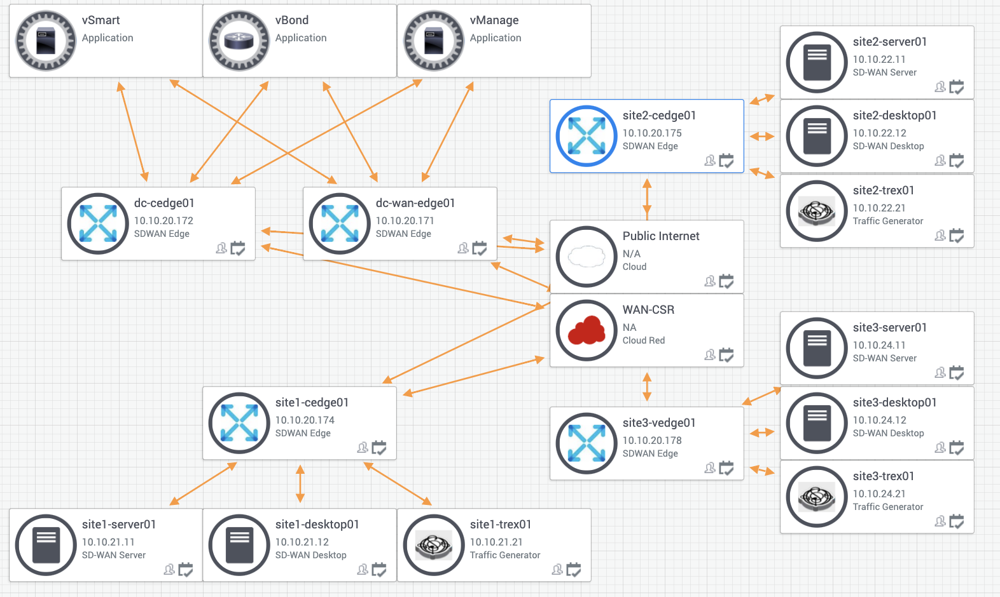
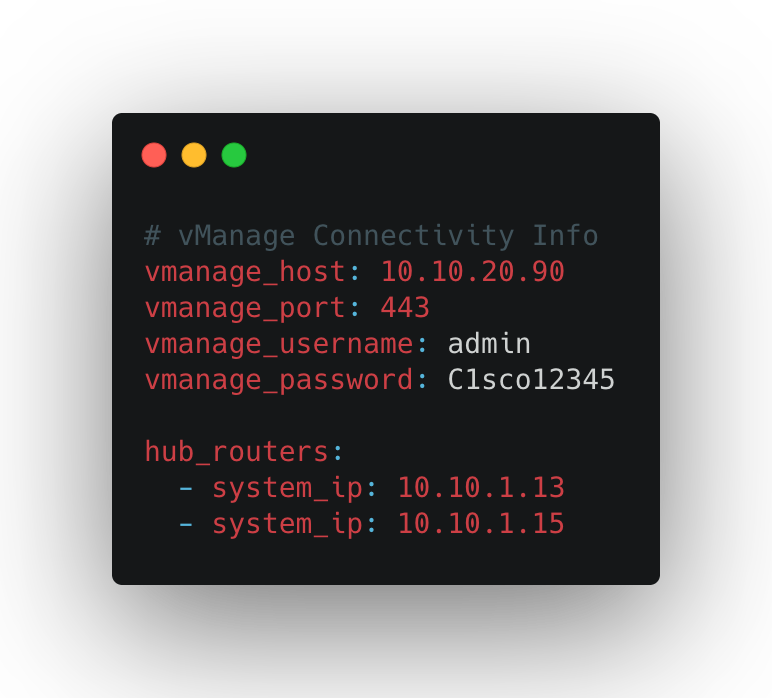
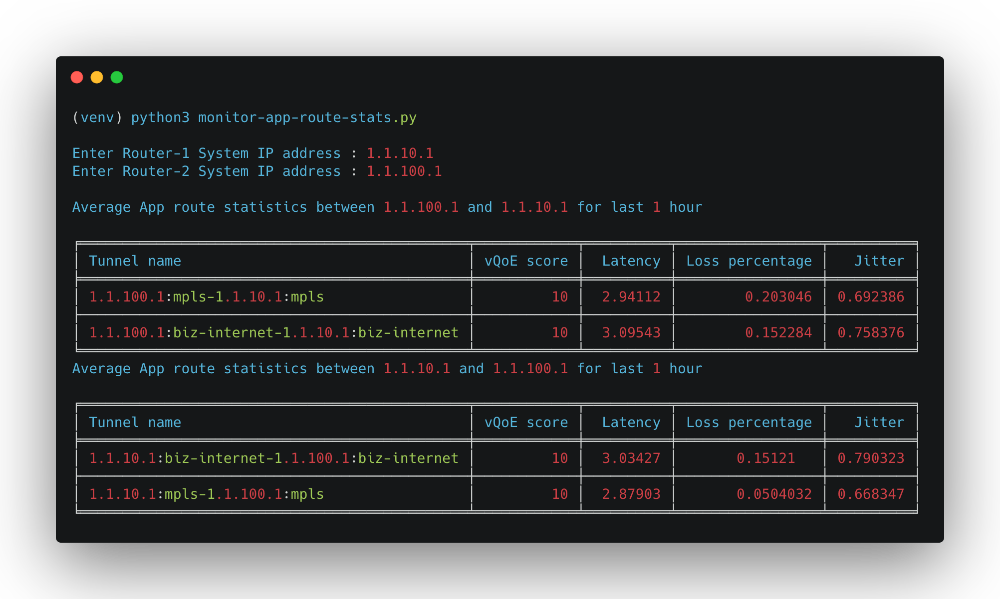

# vManage APIs for Application Aware Routing Policies

This public repo contains python code that can be used to interact with the `Cisco SD-WAN vManage REST API`. The environment is pre-configured to access the [Cisco DevNet Reservable Sandbox for SD-WAN](https://devnetsandbox.cisco.com/RM/Diagram/Index/c9679e49-6751-4f43-9bb4-9d7ee162b069?diagramType=Topology) fabric.You can edit the variables in the environment to point to your own vManage instance. The code contains REST API calls to authenticate, get a list of devices that are part of the SD-WAN fabric. Cisco SD-WAN vManage 19.2.2.




# Objective 

*   How to use vManage APIs - 
    - Monitor Application Aware Routing statistics (BFD statistics) for Overlay Tunnels
    - Create new SLA class list, Application Aware Routing policy and update active vSmart policy
    - Delete SLA class list and Application Aware Routing policy

# Requirements

To use this code you will need:

* Python 3.7+
* vManage user login details. (User should have privilege level to configure policies)

# Install and Setup

- Clone the code to local machine.

```
git clone https://github.com/ciscodevnet/sdwan-application-route-policy.git
cd sdwan-app-route-policy
```
- Setup Python Virtual Environment (requires Python 3.7+)

```
python3.7 -m venv venv
source venv/bin/activate
pip3 install -r requirements.txt
```

- A YAML file with the Cisco SD-WAN Sandbox has been created **vmanage_login.yaml** You can edit the variables in the environment to point to your own vManage instance.

## Example:




## Sample Outputs




```
(venv) python3 create-app-route-policy.py

Please enter App aware route policy which needs to be replaced : AAR4
Latency for new App aware route policy (ms) (1-1000) : 100
Loss percentage for new App aware route policy (%) (1-100) : 8
Jitter for new App aware route policy (ms) (1-1000) : 2

Created new SLA Class devnet_sla_class

Retrieved app aware routing policies list

Retrieved app aware route policy definition AAR4

Created app aware route policy devnet_AAR4

Retrieved activated vsmart policy

Updating vsmart policy with new app aware route policy

Updated vsmart policy with new app aware route policy

 viptela-policy:policy
  sla-class devnet_sla_class
   latency 100
   loss 8
   jitter 2
  !
 !
 app-route-policy _CorpVPN_devnet_AAR4
  vpn-list CorpVPN
    sequence 1
     match
      dscp 46
      source-ip 0.0.0.0/0
     !
     action
      sla-class devnet_sla_class  preferred-color mpls
     !
    !
 !
 lists
  site-list All_Sites
   site-id 10
   site-id 20
   site-id 100
  !
  vpn-list CorpVPN
   vpn 1
  !
 !
!
viptela-policy:apply-policy
 site-list All_Sites
  app-route-policy _CorpVPN_devnet_AAR4
 !
!
```


```
(venv) python3 delete-app-route-policy.py

Please enter App aware route policy which was replaced : AAR4

Retrieved app aware route policy definition AAR4

Retrieved activated vsmart policy

Updated vsmart policy with old app aware route policy

 viptela-policy:policy
  sla-class DSCP46
   latency 50
   loss 10
   jitter 100
  !
 app-route-policy _CorpVPN_AAR4
  vpn-list CorpVPN
    sequence 1
     match
      dscp 46
      source-ip 0.0.0.0/0
     !
     action
      sla-class DSCP46  preferred-color mpls
     !
    !
 !

 lists
  site-list All_Sites
   site-id 10
   site-id 20
   site-id 100
  !
  vpn-list CorpVPN
   vpn 1
  !
 !
!
viptela-policy:apply-policy
 site-list All_Sites
  app-route-policy _CorpVPN_AAR4
 !
!


Deleted devnet_ app route policy

Deleted devnet_sla_class
```
