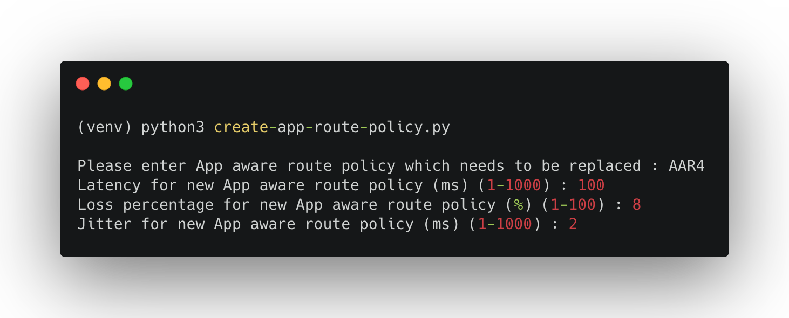
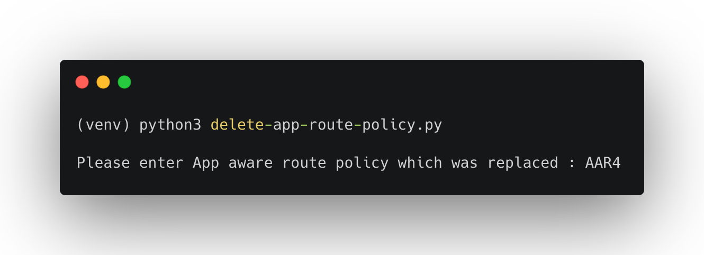

# vManage APIs for Application Aware Routing Policies

This public repo contains python code that can be used to interact with the `Cisco SD-WAN vManage REST API`. The environment is pre-configured to access the [Cisco DevNet Reservable Sandbox for SD-WAN](https://devnetsandbox.cisco.com/RM/Diagram/Index/c9679e49-6751-4f43-9bb4-9d7ee162b069?diagramType=Topology) fabric.You can edit the variables in the environment to point to your own vManage instance. The code contains REST API calls to authenticate, get a list of devices that are part of the SD-WAN fabric. Cisco SD-WAN vManage 19.2.2.


# Objective 

*   How to use vManage APIs - 
    - Monitor Application Aware Routing statistics (BFD statistics) for Overlay Tunnels
    - Create new SLA class list, Application Aware Routing policy and update active vSmart policy
    - Delete SLA class list and Application Aware Routing policy

# Requirements

To use this code you will need:

* Python 3.7+
* vManage user login details. (User should have privilege level to configure policies)

# Install and Setup

- Clone the code to local machine.

```
git clone https://github.com/ciscodevnet/sdwan-application-route-policy.git
cd sdwan-app-route-policy
```
- Setup Python Virtual Environment (requires Python 3.7+)

```
python3.7 -m venv venv
source venv/bin/activate
pip3 install -r requirements.txt
```

- A YAML file with the Cisco SD-WAN Sandbox has been created **vmanage_login.yaml** You can edit the variables in the environment to point to your own vManage instance.

## Example:


## Sample Outputs


## Sample: Create new SLA class list, Application Aware Routing policy and update active vSmart policy



## Sample: Delete SLA class list and Application Aware Routing policy


